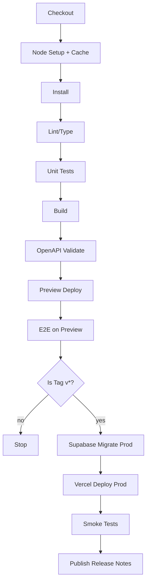

# DEPLOYMENT_PIPELINE.md — Real Deal Kickz

> **Goal:** Reproducible, auditable, and safe deployments with **version enforcement via Git tags** and guardrails across build → test → release. Targets Vercel (Next.js) + Supabase + Stripe webhooks.

---

## 1) Branch & Release Strategy

### 1.1 Branches
- **`jacob-dev`**: Feature development. CI runs all checks; deploys optional previews.
- **`main`**: Production. Merge to `main` triggers release process (requires tag).

### 1.2 Versioning (Enforced)
- **Semantic Tags**: `vMAJOR.MINOR.PATCH` (e.g., `v0.1.0`).
- **Rule**: Production deploy **must** be initiated by a signed Git tag (`v*`).
- **Rationale**: Immutable link between code, OpenAPI spec, database migrations, and runtime artifacts.

### 1.3 Release Types
| Type | Examples | Policy |
|------|----------|--------|
| **Patch** | hotfix, minor bug | `vX.Y.Z+1`; no schema change |
| **Minor** | new feature | `vX.Y+1.0`; backward compatible |
| **Major** | breaking API/schema | `vX+1.0.0`; migration window + comms |

---

## 2) Required Checks (Quality Gates)

- **Static**: Type check, ESLint.
- **Unit**: Jest for utilities, components, and server actions.
- **E2E**: Playwright against Vercel preview.
- **API Contract**: Validate `docs/API_SPEC.yaml` (OpenAPI 3.1) with `openapi-cli validate`.
- **Schema**: Supabase migration dry-run (CI) + checksum match.
- **Security**: `npm audit` (allowlist reviewed), Dependabot baseline.

**Blocking Condition**: Any failing check blocks release.

---

## 3) CI/CD Workflow (GitHub Actions)

### 3.1 Event Triggers
```yaml
on:
  push:
    branches: [ jacob-dev ]
    tags: [ 'v*' ]  # Only tags trigger production releases
  pull_request:
    branches: [ jacob-dev, main ]
```

### 3.2 Jobs Overview


### 3.3 Sample Workflow (simplified)
```yaml
name: CI
jobs:
  build-test:
    runs-on: ubuntu-latest
    steps:
      - uses: actions/checkout@v4
        with: { fetch-depth: 0 }
      - uses: actions/setup-node@v4
        with: { node-version: 20, cache: 'npm' }
      - run: npm ci
      - run: npm run lint && npm run typecheck
      - run: npm run test -- --ci --reporter=junit
      - run: npm run build
      - name: Validate OpenAPI
        run: npx @redocly/cli@latest lint docs/API_SPEC.yaml
      - name: Deploy Preview (PRs / jacob-dev)
        if: ${{ github.ref == 'refs/heads/jacob-dev' || github.event_name == 'pull_request' }}
        run: npx vercel --token ${{ secrets.VERCEL_TOKEN }} --yes --confirm
      - name: Run E2E against Preview
        if: ${{ github.ref == 'refs/heads/jacob-dev' || github.event_name == 'pull_request' }}
        run: npx playwright test
  release:
    needs: build-test
    if: startsWith(github.ref, 'refs/tags/v')
    runs-on: ubuntu-latest
    steps:
      - uses: actions/checkout@v4
        with: { fetch-depth: 0 }
      - uses: actions/setup-node@v4
        with: { node-version: 20, cache: 'npm' }
      - run: npm ci && npm run build
      - name: Supabase Migrations (Prod)
        env:
          SUPABASE_ACCESS_TOKEN: ${{ secrets.SUPABASE_ACCESS_TOKEN }}
          SUPABASE_PROJECT_ID: ${{ secrets.SUPABASE_PROJECT_ID }}
        run: |
          npx supabase db push --project-ref $SUPABASE_PROJECT_ID --db-url $SUPABASE_DB_URL
      - name: Deploy to Vercel (Prod)
        env:
          VERCEL_TOKEN: ${{ secrets.VERCEL_TOKEN }}
        run: npx vercel --token $VERCEL_TOKEN --prod --confirm
      - name: Post-deploy Smoke Tests
        run: npm run smoke
      - name: Create GitHub Release
        uses: softprops/action-gh-release@v2
        with:
          generate_release_notes: true
```

---

## 4) Environments & Secrets

| Env | Provider | Secrets |
|-----|----------|---------|
| **Local** | `.env.local` | test keys only |
| **CI** | GitHub Secrets | `VERCEL_TOKEN`, `SUPABASE_*`, `STRIPE_*`, `SENTRY_DSN` |
| **Prod** | Vercel Env Vars | runtime secrets & public keys |

**Principles**
- No secrets in git. Rotate on incident or quarterly (Security policy).
- Minimal secret exposure per job (scoped env).

---

## 5) Database Migrations

- **Source of Truth**: `/supabase/migrations/*`.
- **Flow**: generate migration → review → merge → **dry‑run in CI** → apply on release job before app deploy.
- **Rollback**: paired down migration or tagged revert; hotfix tag `vX.Y.Z-hotfix` if needed.

**Guardrails**
- Backward compatible changes in minors; breaking changes only in majors with comms.

---

## 6) Rollouts, Rollbacks & Hotfixes

### 6.1 Rollout
- Deploy on tag `v*`; Vercel immutable build identified by tag.

### 6.2 Rollback
- Re-deploy previous Vercel build from dashboard or `vercel deploy --prod --archive <id>`.
- If schema changed, deploy paired **down** migration first.

### 6.3 Hotfix Flow
1. Branch from `main` → `hotfix/<issue>`.
2. Patch; bump patch version; tag `vX.Y.Z+1`.
3. Run release workflow (migrations optional, discouraged).

---

## 7) Feature Flags & Config

- Early flags via env or lightweight `config` table in Supabase (read-only for app, writable by admins).
- Flags gated by `NEXT_PUBLIC_` for client-exposed or server-only env for backend toggles.

---

## 8) Deployment Checks & Health

- **Pre‑deploy**: CI all green.
- **During**: watch Vercel build logs.
- **Post‑deploy**: run `/healthz`, `/readyz`, and homepage smoke; confirm Stripe webhook delivery (dashboard → recent events).

**Automated smoke (script example)**
```bash
curl -fsS https://realdealkickz.vercel.app/healthz
curl -fsS https://realdealkickz.vercel.app/api/v1/products
```

---

## 9) OpenAPI & Client Compatibility

- Keep `docs/API_SPEC.yaml` in repo; bump minor on additive changes.
- Generate typed client (optional Phase 2) during CI to prevent drift.

---

## 10) Governance & Protections

- **Protected Branch**: `main` requires PR review + status checks.
- **Required Sign‑offs**: at least 1 reviewer for production changes.
- **Tag Protection**: only maintainers can push `v*` tags.
- **Audit Trail**: GitHub Releases auto‑generated; link to commit SHAs, build ID, and migration IDs.

---

## 11) Common Failure Modes → Mitigations

| Failure | Symptom | Mitigation |
|---------|---------|-----------|
| Missing tag | CI passes, no prod deploy | Gate: release job runs only on tags |
| Env mismatch | Runtime errors post-deploy | `.env.example` parity + env validator |
| Webhook secret mismatch | Stripe 400s | Validate secrets; rotate and retry |
| Long build times | CI >8m | Enable node cache; prune optional deps |
| Schema drift | Queries fail | Dry-run/plan and checksums in CI |

---

## 12) CVL Checkpoints (Pipeline)

- **Assumptions Check**: tagged releases always reflect prod — validated by artifact ID + release notes.
- **Failure Pathways**: migrations fail → block app deploy; add rollback plan.
- **Redundancy Check**: avoid duplicate test steps between PR and tag workflows.
- **Goal Alignment**: pipeline optimizes for safety over speed at MVP.
- **Execution Risk**: secrets exposure — scoped env + masked logs.
- **Strategic Soundness**: rely on proven tools (Vercel, Supabase, Actions) and keep steps minimal.

---

**Deployment process is now deterministic and auditable with semantic tags and strict CI gates.**

