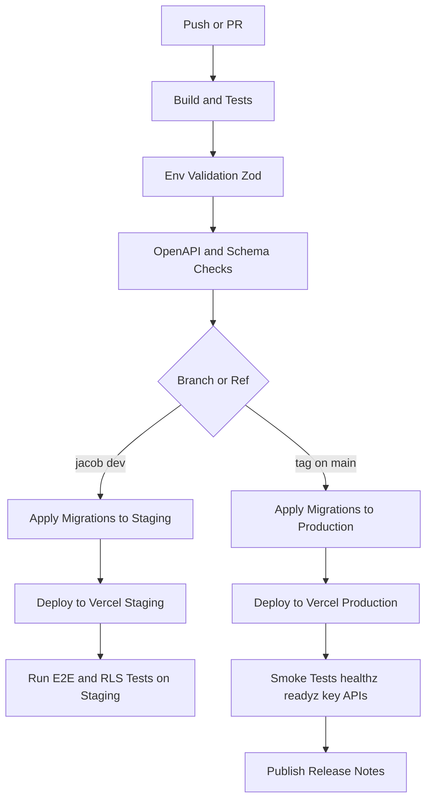

# DEPLOYMENT_PIPELINE.md — Real Deal Kickz

> Goal: Reproducible, auditable, and safe deployments across Local → Staging → Production with version-enforced releases, environment validation, and explicit database migrations.

---

## 1) Environments, Branches & Release Strategy

### 1.1 Environments

| Env          | Purpose                          | Branch / Trigger           | Supabase Project  | Vercel Project / Env |
|--------------|----------------------------------|----------------------------|-------------------|----------------------|
| **Local**    | Fast dev iteration               | `npm run dev` / Docker     | Local or Staging  | Local only           |
| **Staging**  | Prod-like integration & load     | Push to `jacob-dev`        | `supabase-stg`    | `rdk-staging`        |
| **Production** | Stable customer-facing runtime | **Git tag** `v*` on `main` | `supabase-prod`   | `realdealkickz`      |

**Rules**

- Every change flows **Local → Staging → Production**.
- **Staging** runs against the **same migrations** and **same env validation rules** as Production.
- **Production** deploys are **tag-only** and must point at a commit that has passed all checks on Staging.

### 1.2 Branches

- **`jacob-dev`**
  - Feature + integration branch.
  - Push → CI (lint, tests, build, env validation, migration dry-run) → **Staging deploy**.
- **`main`**
  - Protected production branch.
  - PR from `jacob-dev` → review → merge.
  - **Tag** on `main` (`v*`) → Production release.

### 1.3 Versioning (Enforced)

- **Semantic tags**: `vMAJOR.MINOR.PATCH` (e.g., `v0.2.3`).
- **Production deploys run only on signed Git tags** (`v*`) pointing to `main`.
- Each tag ties together:
  - Code (Git SHA)
  - OpenAPI spec version (`docs/API_SPEC.yaml`)
  - Supabase migration set (`/supabase/migrations/*`)
  - Release notes (GitHub Release)

### 1.4 Promotion Flow (Summary)

1. Develop on `jacob-dev`.
2. Push → CI → deploy to **Staging**.
3. Validate on Staging (manual + automated).
4. Open PR `jacob-dev → main`, merge when green.
5. Tag `main` commit as `vX.Y.Z`.
6. Tag triggers **Production release job**:
   - Apply Prod migrations
   - Deploy to Vercel Prod
   - Run smoke tests

---

## 2) Required Checks (Quality Gates)

The pipeline fails fast on **any misconfiguration** or breaking change.

### 2.1 Build & Code Quality

- **Static**: TypeScript typecheck, ESLint.
- **Unit**: Jest (utilities, services, repositories, jobs).
- **Integration**: Route Handlers + Supabase (where feasible via test DB).

### 2.2 Environment Validation (Zod)

- Centralized module: `src/config/env.ts` (Zod schema).
- Command (example): `npm run env:check` (called in CI).
- Behavior:
  - Validates **all required env vars** for the target environment (Staging/Prod).
  - CI **fails** if any required variable is missing, malformed, or inconsistent.
  - Ensures rate limiting keys, Supabase URLs, Stripe keys, etc., are always present.

### 2.3 API Contract & Schema

- **API Spec**:
  - `docs/API_SPEC.yaml` validated with `openapi-cli` (Redocly or similar).
- **Supabase Schema**:
  - **Source of truth**: `/supabase/migrations/*`.
  - CI runs **migration dry-run** (or `supabase db lint/check`) before any deploy step.

### 2.4 RLS & Multi-Tenant Tests

- Test suite (example commands):
  - `npm run test:rls` — verifies row-level security and tenant isolation.
- Ensures:
  - Users can only access their own resources.
  - Admins can access all relevant rows.
  - Future tenant/seller isolation rules hold.

### 2.5 Security & Dependency Checks

- `npm audit --audit-level=high` (or curated allowlist).
- Dependabot for dependency upgrades (Phase 2+).
- Optional: GitHub CodeQL (Phase 2+).

**Blocking Condition:** Any failing check **blocks** Staging or Production releases.

---

## 3) CI/CD Workflow (GitHub Actions)

### 3.1 Event Triggers

```yaml
on:
  push:
    branches: [ jacob-dev ]
    tags: [ 'v*' ]    # Only version tags trigger Production
  pull_request:
    branches: [ jacob-dev, main ]
### 3.2 High-Level Flow



### 3.3 Sample Workflow (Simplified – Multi-Job)

> Note: This is illustrative; adapt names/commands to your actual scripts.
> 

```yaml
name: CI

jobs:
  build-test:
    runs-on: ubuntu-latest
    steps:
      - uses: actions/checkout@v4
        with:
          fetch-depth: 0
      - uses: actions/setup-node@v4
        with:
          node-version: 20
          cache: npm

      - name: Install deps
        run: npm ci

      - name: Env Validation (Zod)
        env:
          NODE_ENV: test
        run: npm run env:check

      - name: Lint & Typecheck
        run: |
          npm run lint
          npm run typecheck

      - name: Unit Tests
        run: npm test -- --ci --reporter=junit

      - name: Build
        run: npm run build

      - name: Validate OpenAPI Spec
        run: npx @redocly/cli@latest lint docs/API_SPEC.yaml

      - name: Schema Lint / Dry Run
        env:
          SUPABASE_ACCESS_TOKEN: ${{ secrets.SUPABASE_ACCESS_TOKEN }}
          SUPABASE_PROJECT_ID: ${{ secrets.SUPABASE_STAGING_PROJECT_ID }}
        run: |
          # Example: dry run / validate migrations (adapt command)
          npx supabase db lint --project-ref $SUPABASE_PROJECT_ID

  deploy-staging:
    needs: build-test
    if: github.ref == 'refs/heads/jacob-dev'
    runs-on: ubuntu-latest
    steps:
      - uses: actions/checkout@v4
        with:
          fetch-depth: 0
      - uses: actions/setup-node@v4
        with:
          node-version: 20
          cache: npm
      - run: npm ci

      - name: Apply Migrations to Staging
        env:
          SUPABASE_ACCESS_TOKEN: ${{ secrets.SUPABASE_ACCESS_TOKEN }}
          SUPABASE_PROJECT_ID: ${{ secrets.SUPABASE_STAGING_PROJECT_ID }}
          SUPABASE_DB_URL: ${{ secrets.SUPABASE_STAGING_DB_URL }}
        run: |
          npx supabase db push --project-ref $SUPABASE_PROJECT_ID --db-url $SUPABASE_DB_URL

      - name: Deploy to Vercel (Staging)
        env:
          VERCEL_TOKEN: ${{ secrets.VERCEL_TOKEN }}
        run: |
          npx vercel --token $VERCEL_TOKEN --yes --scope ${{ secrets.VERCEL_SCOPE }} --prod=false

      - name: Run E2E + RLS Tests against Staging
        env:
          STAGING_BASE_URL: ${{ secrets.STAGING_BASE_URL }}
        run: |
          npm run test:e2e
          npm run test:rls

  release:
    needs: build-test
    if: startsWith(github.ref, 'refs/tags/v')
    runs-on: ubuntu-latest
    steps:
      - uses: actions/checkout@v4
        with:
          fetch-depth: 0
      - uses: actions/setup-node@v4
        with:
          node-version: 20
          cache: npm
      - run: npm ci
      - run: npm run build

      - name: Env Validation (Production Config)
        env:
          NODE_ENV: production
        run: npm run env:check

      - name: Apply Migrations to Production
        env:
          SUPABASE_ACCESS_TOKEN: ${{ secrets.SUPABASE_ACCESS_TOKEN }}
          SUPABASE_PROJECT_ID: ${{ secrets.SUPABASE_PROD_PROJECT_ID }}
          SUPABASE_DB_URL: ${{ secrets.SUPABASE_PROD_DB_URL }}
        run: |
          npx supabase db push --project-ref $SUPABASE_PROJECT_ID --db-url $SUPABASE_DB_URL

      - name: Deploy to Vercel (Production)
        env:
          VERCEL_TOKEN: ${{ secrets.VERCEL_TOKEN }}
        run: |
          npx vercel --token $VERCEL_TOKEN --prod --confirm

      - name: Post-Deploy Smoke Tests
        env:
          PROD_BASE_URL: https://realdealkickzsc.com
        run: |
          npm run smoke

      - name: GitHub Release Notes
        uses: softprops/action-gh-release@v2
        with:
          generate_release_notes: true

```

---

## 4) Environments & Secrets

### 4.1 Secret Locations

| Env | Storage | Examples |
| --- | --- | --- |
| **Local** | `.env.local` | `SUPABASE_URL`, `SUPABASE_ANON_KEY`, `STRIPE_SECRET_KEY` (test), etc. |
| **Staging CI** | GitHub Secrets | `SUPABASE_STAGING_DB_URL`, `SUPABASE_STAGING_PROJECT_ID`, `VERCEL_TOKEN` |
| **Prod CI** | GitHub Secrets | `SUPABASE_PROD_DB_URL`, `SUPABASE_PROD_PROJECT_ID`, `VERCEL_TOKEN` |
| **Runtime** | Vercel Env Vars | All runtime secrets (`STRIPE_*`, `SUPABASE_*`, Upstash, Sentry, etc.) |

**Principles**

- No secrets in git.
- Zod env module **must fail** if anything critical is missing.
- Staging and Prod share the **same env schema**; values change, not the shape.
- Secrets **rotate on incident** and at least **quarterly** (per Security policy).
- Minimal secret exposure per job (**scoped env**): each CI job only gets the secrets it needs.

### 4.2 Feature Flags & Config (Restored)

- Early feature flags via env or a lightweight `config` table in Supabase (read-only for app, writable by admins).
- Client-exposed flags must use `NEXT_PUBLIC_*`.
- Backend-only flags must use server-only env vars.
- Flags **must not** weaken auth, RLS, or payment safety (no security bypass via flags).
- Use flags for:
    - Gradual rollout of new UI or product types.
    - Toggling non-critical background jobs or analytics.

---

## 5) Database Migrations

- **Source of Truth:** `/supabase/migrations/*`.
- Generated via `supabase db diff` and committed to repo.

**Flow**

1. Dev: generate migration → run locally → commit.
2. CI: lint/dry-run migrations on `jacob-dev` pushes.
3. Staging: on `jacob-dev`, apply migrations to **Staging** before deploy.
4. Prod: on tag `v*`, apply migrations to **Prod** before deploy.

**Rollback Strategy**

- Prefer **forward-fix** migrations.
- For destructive changes, pair with explicit **down-migration**.
- If production deploy is bad:
    - Re-deploy previous tag.
    - Apply corrective migration if needed.

**Guardrails (Restored)**

- Changes in **MINOR** versions should be **backward compatible**.
- **Breaking** schema changes only in **MAJOR** releases with clear comms and a migration window.
- All migrations must be:
    - Tested locally.
    - Dry-run in CI.
    - Logged and tied to a Git tag for traceability.

---

## 6) Rollouts, Rollbacks & Hotfixes

### 6.1 Rollout (Normal)

1. Develop on `jacob-dev`.
2. CI → Staging deploy + E2E/RLS tests.
3. Manual QA on Staging.
4. PR `jacob-dev → main`, merge when green.
5. Tag `main` commit (`vX.Y.Z`).
6. Tag triggers Production migrations + deploy + smoke tests.
7. Vercel builds are **immutable** and can be identified and re-deployed by tag/build ID.

### 6.2 Rollback

- **Application Only:**
    - Use Vercel to re-deploy previous build (identified by tag or via:
        
        `vercel deploy --prod --archive <build-id>`).
        
- **Schema + Application:**
    - Deploy paired down-migration, then re-deploy previous tag.
    - Validate via `/healthz`, `/readyz`, and core flows (checkout, admin login).

### 6.3 Hotfix Flow

1. Branch from `main` → `hotfix/<issue>`.
2. Implement minimal fix.
3. Merge back into `main`.
4. Tag patch version (`vX.Y.(Z+1)`).
5. Release job runs migrations (if absolutely required) and deploy.
6. Back-merge hotfix into `jacob-dev`.

---

## 7) Deployment Checks & Health

### 7.1 Pre-Deploy

- `jacob-dev`:
    - CI all green (lint, tests, build, env validation, schema checks).
- `main`:
    - PR approved, CI green, Staging validated.

### 7.2 During Deploy

- Watch GitHub Actions logs for migration step.
- Watch Vercel logs for build completion.

### 7.3 Post-Deploy

- Automated smoke tests:
    - `/healthz` (liveness)
    - `/readyz` (readiness)
    - Selected APIs: products catalog, product detail, Stripe checkout init.
- Manual spot check (production):
    - Homepage
    - Sample product
    - Admin login
    - Test checkout in Stripe **test mode** (if toggled).

### 7.4 Automated Smoke Script Example (Restored)

Example of simple CLI smoke commands after deploy:

```bash
# Liveness & readiness
curl -fsS https://realdealkickz.vercel.app/healthz
curl -fsS https://realdealkickz.vercel.app/readyz

# Critical API path
curl -fsS https://realdealkickz.vercel.app/api/v1/products

```

Additionally, confirm Stripe webhooks in the Stripe Dashboard (`Developers → Webhooks → Recent events`).

---

## 8) OpenAPI, Clients & Background Jobs

- **OpenAPI**:
    - `docs/API_SPEC.yaml` is linted on every CI run.
    - Bump **minor** version for additive changes; **major** for breaking changes.
- **Generated Clients** (optional Phase 2):
    - Generated in CI to prevent contract drift.
- **Background Jobs & Webhooks**:
    - Jobs live in `src/jobs/*`.
    - Stripe webhooks, cache revalidation, and long-running workflows are tested as part of E2E / integration tests.
    - Pipeline ensures job modules build and pass tests before any deploy.

---

## 9) Governance & Protections

- **Protected Branch:** `main` requires PR + passing status checks.
- **Tag Protection:** Only maintainers can create `v*` tags.
- **Required Sign-offs (Restored):** At least **1 reviewer** must approve production-impacting changes.
- **Audit Trail (Extended):**
    - GitHub Releases auto-generated from tags.
    - Each release links: commit SHA, **build ID**, migration IDs, and key notes.
- **CVL (Critical Validation Loop) in Pipeline:**
    - **Assumptions:** Env parity enforced via Zod and `.env.example`.
    - **Failure Pathways:** Migrations or env validation failures block deploy.
    - **Redundancy:** Shared steps live in `build-test` job; no duplicate heavy work.
    - **Goal Alignment:** Safety prioritized over deployment speed.
    - **Execution Risk:** Secrets scoped per job; logs mask sensitive values.
    - **Strategic Soundness:** Uses Vercel, Supabase, GitHub Actions — proven, managed services.

---

## 10) Common Failure Modes → Mitigations

| Failure | Symptom | Mitigation |
| --- | --- | --- |
| Missing / malformed env vars | Runtime errors, 500s on startup | Zod env validation fails CI before deploy |
| Schema drift between Staging & Prod | Queries fail only in Prod | Single migration source + staged rollout; migrations run in both envs |
| RLS / tenant isolation misconfig | Users see other users’ data | RLS test suite in CI; Staging E2E + RLS tests block releases |
| Abuse traffic / scraper spike | Elevated 429/5xx; Stripe/Supabase strain | Edge rate limiting via Upstash; monitor and adjust thresholds |
| Cache staleness after updates | Old data on product/catalog pages | Webhook/service jobs trigger `revalidateTag` and cache clear |
| Stripe webhook replay / mismatch | Duplicate orders, 400s on webhook | Signature verification + idempotency; tests against Staging before Prod |
| Load-test failures on Staging | High latency / 5xx under load | Load test Staging only; fix bottlenecks before tagging for Prod |

### 10.1 Additional High-Signal Cases (Restored)

| Failure | Symptom | Mitigation |
| --- | --- | --- |
| Missing tag | CI passes, no prod deploy | Gate: release job runs only on `v*` tags |
| Env mismatch | Runtime errors post-deploy | Maintain `.env.example` parity + env validator |
| Webhook secret mismatch | Stripe 400s | Validate secrets; rotate and retry; test in Staging first |
| Long build times | CI > 8 minutes | Enable Node cache; prune optional/dead dependencies |
| Schema drift (general) | Queries fail in unexpected ways | Dry-run/plan migrations and enforce checksums in CI |